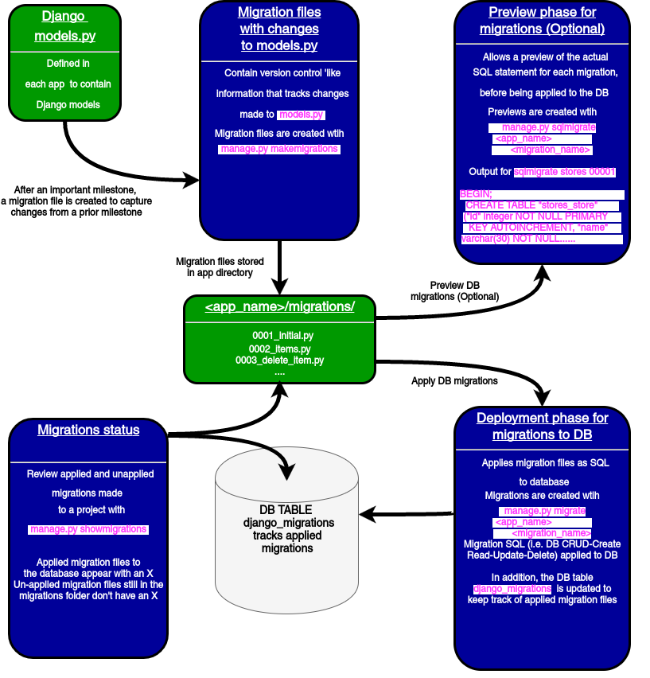
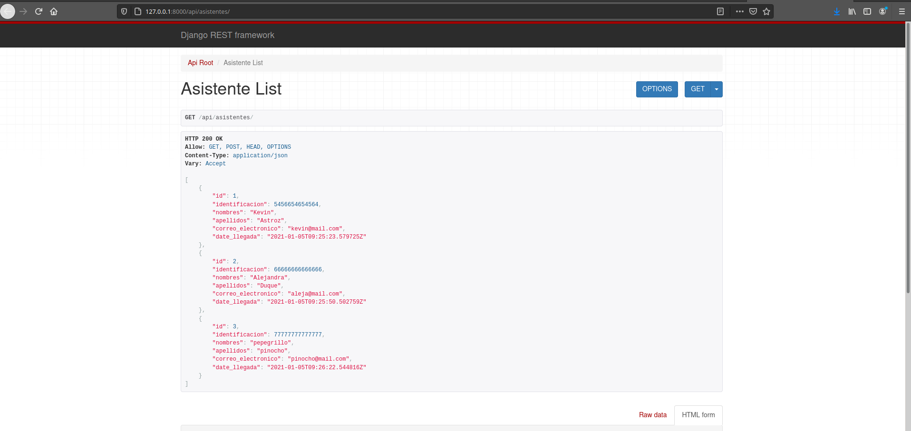
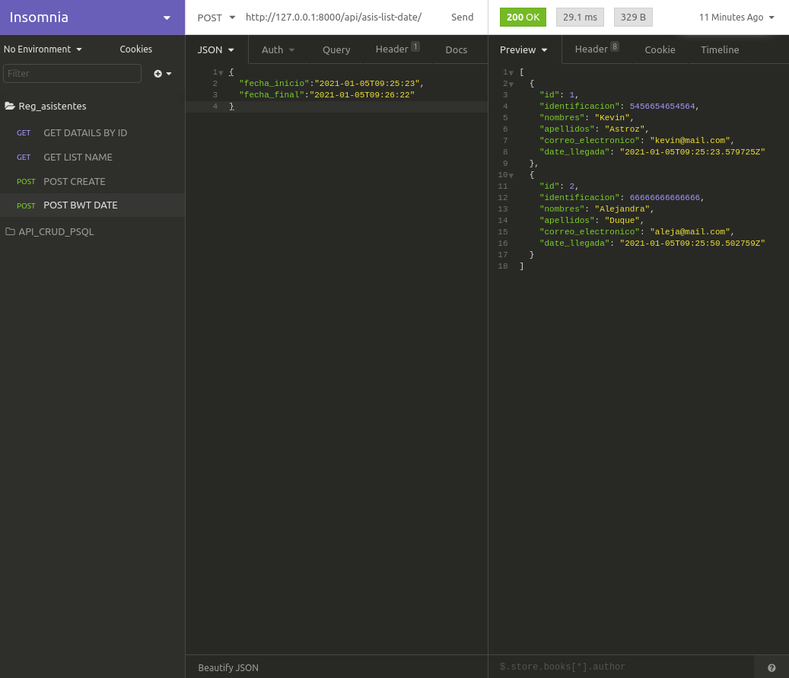

# Enunciado

La prueba consiste en un proyecto para generar un microservicio teórico en Django (RestFramework) no se requiere que se desarrolle completamente sino que se respondan las preguntas teniendo como contexto los requerimientos y que en las preguntas que se marcan como "Enviar Código" se pueda tener el código generado, solo se requieren los archivos específicos de la prueba (.py) la cual deberá ser desarrollada en el equipo del aspirante. NO SE REQUIEREN INTERFACES DE USUARIO, solo los microservicios. 

## El requerimiento es un registro de asistentes a un evento, que tenga

- Número de Identificación
- Nombres
- Apellidos
- correo electrónico
- fecha y hora de llegada.
- Debe garantizar que no se repitan números de cédula ni correos electrónicos (retornar mensaje de error si ocurre)
- Debe validar que el número de identificación sea numérico y que el correo electrónico sea sintácticamente válido.

## Diseñe el modelo (Enviar código)

```python
class Asistente(models.Model):
    identificacion = models.BigIntegerField(
        unique = True,
        validators =[ValidateNumber],
        error_messages = {
            "unique":"Ya existe la identificacion",
            "required": "Identificacion es necesaria"
        }
    )

    nombres = models.TextField(
        error_messages = {
            "required": "Nombres es necesario"
        }
    )

    apellidos = models.TextField(
        error_messages = {
            "required": "Apellidos es necesario"
        }
    )

    correo_electronico = models.EmailField(
        max_length = 254, 
        unique = True, 
        error_messages = {
            "unique":"Ya existe el correo",
            "required": "correo es necesario"
        },
        validators =[ValidateEmail]
    )

    date_llegada = models.DateTimeField(auto_now_add=True)
```

## ¿Como implementaría las validaciones en el modelo?

Las validaciones que se realizan dentro del modelo, van en el constructor del Field especifico, en el parametro `validators`, dentro de este parametro se asignan las diferentes funciones "validadoras" las cuales retornan un error en llegado caso que ocurra. En el anterior modelo se puede ver la funcion `ValidateNumber` que valida si la variable del objeto es un numero entero y `ValidateEmail` comprueba por medio de una expresion regular que el correo del objeto cumpla con la estructura de un correo estandar.

ValidateNumber
```python
def ValidateNumber(value):
    if isinstance(value, int): 
        return value 
    else: 
        raise ValidationError("La identificacion no es un valor numerico") 
```

ValidateEmail
```python
def ValidateEmail(email):  
    regex = '^[a-z0-9]+[\._]?[a-z0-9]+[@]\w+[.]\w{2,3}$'
    if(re.search(regex,email)):  
        return email          
    else:  
        raise ValidationError("El correo no cumple con la estructura") 
```

## ¿Como implementaría una clase de repositorio que tenga los métodos de agregar, listar (varios registros por rango de fechas o nombres de la persona) y obtener detalles (con el ID, obtiene todos los campos)

```python
from .serializer import AsistenteSerializador
from .serializer import FechaInputSerializador
from .models import Asistente

class AsistenteRepository():

    """ Listar todos by nombre """
    def listByName(self):
        asist = Asistente.objects.all().order_by('nombres')
        serializer = AsistenteSerializador(asist, many=True)
        return serializer.data

    """ Listar rango de fecha """
    def listBtwDate(self, request):
        fechas = FechaInputSerializador(data=request.data)
        print(fechas)
        if fechas.is_valid():
            asist = Asistente.objects.filter(
            date_llegada__gte=fechas.data['fecha_inicio'], 
            date_llegada__lte=fechas.data['fecha_final'])
            serializer = AsistenteSerializador(asist, many=True)
            return serializer.data
        else:
            return {'error':'se necesitan fechas'}

    """ Agregar """
    def CreateAsis(self, request):
        serializer = AsistenteSerializador(data=request.data)
        if serializer.is_valid():
            serializer.save()
        return serializer.data


    """ Obtener Detalles """
    def detailsById(self, pk):
        asist = Asistente.objects.filter(id=pk)
        serializer = AsistenteSerializador(asist, many=True)
        return serializer.data
```

## Diseñe y programe el controlador (Vista) para agregar un registro, listar y obtener los detalles de un registro

Codigo de la vista

```python
from rest_framework.decorators import api_view
from rest_framework.response import Response
from .class_repository import AsistenteRepository

AsistenteRpObj = AsistenteRepository()


"""
API Overview
"""
@api_view(['GET'])
def apiOverview(request):
    api_urls = {
        'Listar todos by nombre' : '/asis-list/',
        'Listar rango de fecha' : '/asis-list-date/',
        'Agregar' : '/asis-create/',
        'Obtener Detalles' : '/asis-detail/<int:pk>/',
    }
    return Response(api_urls)

@api_view(['GET'])
def asisList(request):
    AllDataByName = AsistenteRpObj.listByName()
    return Response(AllDataByName)

@api_view(['GET'])
def asisDetail(request, pk):
    OneDataByPk = AsistenteRpObj.detailsById(pk)
    return Response(OneDataByPk)


@api_view(['POST'])
def asisCreate(request):
    CreateResult = AsistenteRpObj.CreateAsis(request)
    return Response(CreateResult)

@api_view(['POST'])
def asisListDate(request):
    AllDataByDates = AsistenteRpObj.listBtwDate(request)
    return Response(AllDataByDates)
```

1. Agregar un registro

**Peticion**

```
curl --request POST \
  --url http://127.0.0.1:8000/api/asis-create/ \
  --header 'Content-Type: application/json' \
  --data '{
		"identificacion": 1111111111,
    "nombres": "David",
    "apellidos": "Quintero",
    "correo_electronico": "david@mail.com"
}'
```

2. Listar registros order by nombre

**Peticion**
```
curl --request GET \
  --url http://127.0.0.1:8000/api/asis-list/
```

3. Listar registros between date_llegada

**Peticion**

```
curl --request POST \
  --url http://127.0.0.1:8000/api/asis-list-date/ \
  --header 'Content-Type: application/json' \
  --data '{
	"fecha_inicio":"2021-01-05T09:25:23",
	"fecha_final":"2021-01-05T09:26:22"
}'
```

3. Obtener detalles

**Peticion**

```
curl --request GET \
  --url http://127.0.0.1:8000/api/asis-detail/5/
```

## ¿Que se requiere para que en el método que obtiene la lista no se entregue el correo electrónico pero si el resto de los datos?

Se elimina el elemento que no se quiere mostrar en las lista de respuesta

```python
def listByName(self):
        asist = Asistente.objects.all().order_by('nombres')
        serializer = AsistenteSerializador(asist, many=True)

        for item in serializer.data:
            item.pop('correo_electronico')

        return serializer.data
```

## Cree el código para registrar la URL del servicio

- crud_project/urls.py

```python
from django.contrib import admin
from django.urls import path, include

urlpatterns = [
    path('admin/', admin.site.urls),
    path('api/', include('reg_asistentes.urls'))
]
```

- reg_asistentes/urls.py

```python
from django.urls import path
from . import views

urlpatterns = [
    path('', views.apiOverview, name="api-overview"),
    path('asis-list/', views.asisList, name="asis-list"),
    path('asis-list-date/', views.asisListDate, name="asis-list-date"),
    path('asis-detail/<int:pk>/', views.asisDetail, name="asis-Detail"),
    path('asis-create/', views.asisCreate, name="asis-Create"),
]
```

## Como se sincroniza el modelo con la base de datos? (explique detalladamente el proceso de migración)

Esencialmente la sincronizacion entre el modelo y la base datos ocurre mediente un ORM (objeto de mapeo relacional), este objeto nos permite tener un acuerdo o un contrato por asi decirlo entre entre los modelos de nuestra aplicacion y la base datos, Permitiendonos realizar cambios en nuestros modelos y verlos reflejados en las entidades relacionales de la base de datos. El ORM se puede visualizar como un sistema que se encarga de rastrear las migraciones, mantener un control de versiones de estas migraciones (permitiendo realizar rollback en algun momento) y realizar (y verificar) que estas migraciones se vean reflejadas en la base de datos. Existen tres pasos generales los cuales pueden explicar este proceso.

1. Cambiar el contrato del ORM: Cuando realizamos las modificaciones en los modelos, estamos modificando este contrato, lo que quiere decir que la estructura de las entidades de la base van a cambiar por algun requirimiento. Al realizar estos cambios el ORM cambia su estructura.

2. Planificar el cambio: Una vez cambiado los modelos, se usara un comando de migracion el cual el ORM generara nuestras nuevas entidades a partir de estos cambios y guardandolas en archivos en la carpeta migrations de cada una de las aplicaciones realizadas. Estos archivos contienen la nueva estructura definida por el contrato y se almacenaran para un posterior uso (cuando realicen los cambios en la persistencia)

3. Ejecutar migraciones: Los archivos generados anteriormente son los archivos que se ejecutaran para llevar a acabo las modificaciones en cada una de las tablas definidas. cualquier cambio realizado en nuestra aplicacion (en los modelos especificamente) debera tener una migracion.

```
./manage.py makemigrations app_api
./manage.py migrate
```

Un flujo de estas migraciones se puede ver en la siguiente imagen sacada de https://www.webforefront.com/django/setupdjangomodels.html



# STATUS

1. API REST FUNCIONANDO 


2. INSOMINIA REST


